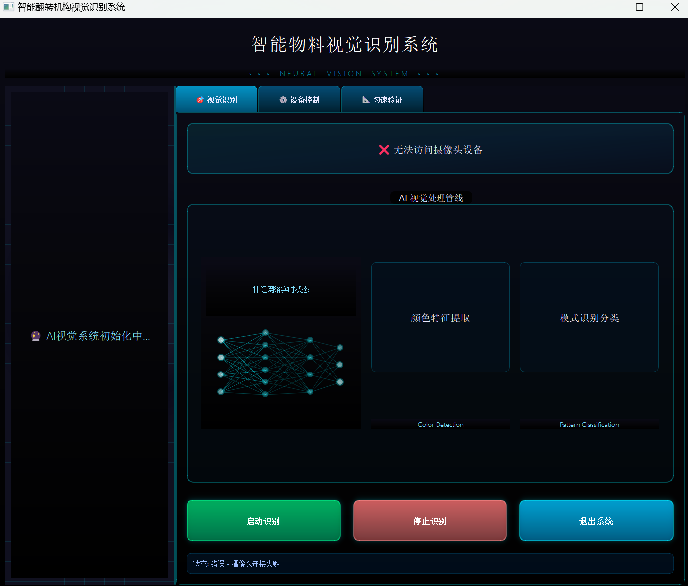
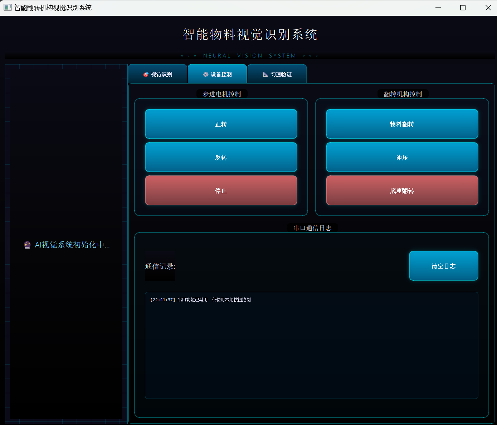
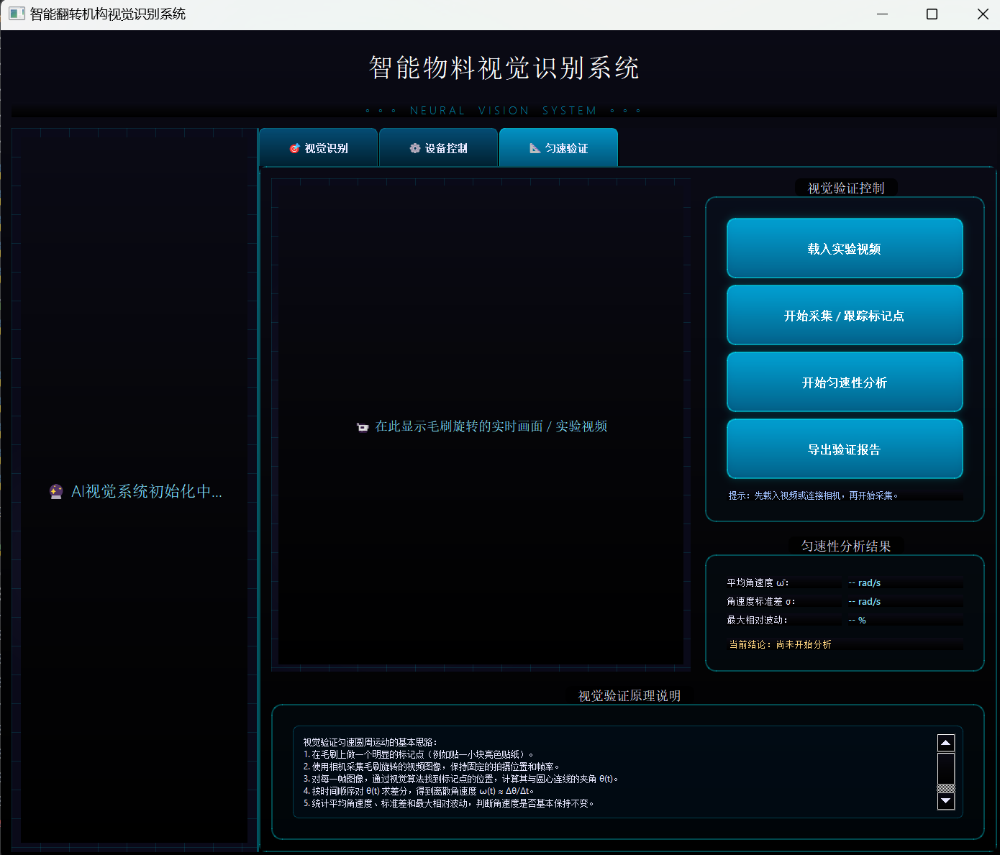

# 智能翻转机构视觉识别系统

## 项目简介

本项目旨在开发一个智能视觉识别系统，结合硬件控制，实现对特定物料的颜色、图案和角度识别，并根据识别结果控制翻转机构进行相应操作。系统主要由基于 PyQt5 的用户界面、后端视觉识别服务和硬件通信模块组成。
实际效果如下所示




## 目录结构

- `backend/`: 后端核心逻辑，包括摄像头管理、颜色检测、模式分类、硬件控制和串口通信。
- `ui/`: 用户界面相关代码，基于 PyQt5 实现。
- `small/`: 包含一些小样本学习的模型训练、评估脚本和测试文件。
- `raw/`: 原始图像数据，用于模型训练和模板匹配。
- `run_app.py`:  项目主入口，启动 PyQt5 应用程序。
- `requirements.txt`: 项目依赖库列表。
- `LICENSE`: 项目许可证文件。
- `.gitignore`: Git 版本控制忽略文件。
- `设计与建造课程报告.pdf`: 项目相关的课程报告。

## 模块功能详解

### `backend/` 模块

- `backend/__init__.py`: Python 包初始化文件。
- `backend/camera_manager.py`: 
  - **功能**: 负责管理摄像头设备的开启、实时预览、帧捕获和图像显示。
  - **主要类**: `CameraManager`。
  - **核心方法**: `start_preview()` (启动预览), `freeze_current_frame()` (定格当前帧), `get_last_frame()` (获取最新帧), `update_process_image()` (更新处理图像显示)。
- `backend/color_detector.py`: 
  - **功能**: 实现物料颜色的检测（主要识别红色或蓝色）。
  - **主要类**: `ColorDetector`。
  - **核心方法**: `detect_color()` (检测颜色，返回 '红色'、'蓝色' 或 '未知'，并返回环形区域图像)。
  - **技术**: 结合灰度处理、中值滤波、CLAHE 增强、Canny 边缘检测和霍夫圆变换来识别圆形区域，并通过 HSV 颜色空间分析平均色调。
- `backend/hardware_controller.py`: 
  - **功能**: 负责串口通信的初始化、数据发送和硬件（步进电机、翻转机构）控制。
  - **主要类**: `HardwareController`。
  - **核心方法**: `setup_serial()` (初始化串口), `send_results()` (发送识别结果到串口屏), `stepper_forward/backward/stop()` (控制步进电机), `flip_forward/backward/stop()` (控制翻转机构)。
- `backend/pattern_classifier/`:
  - `backend/pattern_classifier/__init__.py`: Python 包初始化文件。
  - `backend/pattern_classifier/dataset.py`: 
    - **功能**: 定义用于模式分类和角度预测的数据集 (`ProtoAngleDataset`)，支持 few-shot learning 的 episode 构造。
    - **核心方法**: `get_episode()` (生成包含支持集和查询集的训练/测试 episode)。
  - `backend/pattern_classifier/model.py`: 
    - **功能**: 定义基于 ConvNeXt-Tiny 的原型网络模型 (`ProtoNetWithAngle`)，用于模式分类和角度回归。
    - **技术**: 使用 ConvNeXt-Tiny 作为特征提取主干，结合原型网络进行分类，并额外添加一个线性回归头用于角度预测。
  - `backend/pattern_classifier/pattern_angle_predictor.py`: 
    - **功能**: 集成模式分类和角度预测功能，加载预训练模型并对图像进行预测。
    - **主要类**: `PatternAndAngleClassifier`。
    - **核心方法**: `predict()` (对单张图像进行模式分类和角度预测)。
- `backend/raw/`: 原始图像数据，按类别 (`class1`, `class2`, `class3`) 组织，用于模型训练和角度模板。
- `backend/recognition_controller.py`: 
  - **功能**: 作为视觉识别服务的控制器，接收图像帧并调用 `VisionRecognitionService` 进行推理，然后整理结果。
  - **主要类**: `RecognitionController`。
  - **核心方法**: `run_inference()` (执行推理并返回结构化结果)。
- `backend/serial_io.py`: 
  - **功能**: 提供串口通信的底层实现，包括数据发送 (`ScreenSender`) 和数据接收/信号触发 (`SerialBridge`)。
  - **主要类**: `ScreenSender` (负责 PC 到屏幕/下位机的数据发送), `SerialBridge` (串口监听线程，处理接收到的命令和信号)。
  - **技术**: 使用 `pyserial` 库进行串口操作，并结合 PyQt5 的 `QThread` 和 `pyqtSignal` 实现异步通信。
- `backend/vision_service.py`: 
  - **功能**: 整合颜色检测、模式分类和角度预测，提供统一的视觉识别服务。
  - **主要类**: `VisionRecognitionService`。
  - **核心方法**: `predict_all()` (对图像进行颜色、图案和角度的综合识别)。
  - **技术**: 结合 `ColorDetector` 和 `PatternAndAngleClassifier`，并使用 OpenCV 的特征匹配 (SIFT/ORB) 和仿射变换估计来精确计算角度。

### `ui/` 模块

- `ui/__init__.py`: Python 包初始化文件。
- `ui/config.py`: 存储 UI 相关的配置参数，如串口设置、模型路径、摄像头参数等。
- `ui/custom_widgets.py`: 
  - **功能**: 定义了一系列自定义的 PyQt5 控件，用于增强用户界面的视觉效果和交互性。
  - **主要类**: `NeuralNetworkWidget` (神经网络实时动画), `AnimatedButton` (带动画效果的按钮), `PulsingLabel` (脉冲动画标签), `GradientFrame` (渐变背景框架)。
- `ui/main_window.py`: 
  - **功能**: 实现主应用程序窗口的逻辑，集成后端服务和 UI 元素。
  - **主要类**: `MainWindow` (继承自 `QWidget` 和 `MainWindowUI`)。
  - **核心功能**: 初始化摄像头、识别服务、硬件控制器；连接 UI 信号与槽；处理识别流程和硬件交互。
- `ui/test.py`: 可能包含 UI 相关的测试代码。
- `ui/ui_main_window.py`: 
  - **功能**: 负责主窗口的用户界面布局和控件创建，通常由 UI 设计工具生成或手动编写。
  - **主要类**: `MainWindowUI` (Mixin 类，提供 `setup_ui` 方法来创建和布局所有 UI 元素)。

### `small/` 模块

- `small/.pytest_cache/`: pytest 缓存目录。
- `small/checkpoints/`: 模型检查点存储目录。
- `small/dataset.py`: 
  - **功能**: 独立的图像数据集定义，可能用于模型训练。
  - **技术**: 使用 `torch.utils.data.Dataset` 和 `torchvision.transforms` 进行数据加载和预处理。
- `small/evaluate.py`: 
  - **功能**: 用于评估 `ProtoNetWithAngle` 模型性能的脚本，包括分类准确率和角度平均绝对误差 (MAE)。
  - **技术**: 加载模型权重，构造测试 episode，执行推理并计算指标。
- `small/loss_center.py`: 
  - **功能**: 定义了 Center Loss，一种用于深度学习模型训练的损失函数，旨在增加类内紧凑性。
  - **主要类**: `CenterLoss`。
- `small/model.py`: 
  - **功能**: 独立的模型定义，可能用于训练。
  - **技术**: 与 `backend/pattern_classifier/model.py` 类似，定义了 `ProtoNetWithAngle` 模型。
- `small/predict_test_images.py`: 用于对测试图像进行预测的脚本。
- `small/raw/`: 原始图像数据，按类别组织，可能用于 `small` 模块中的模型训练。
- `small/test_images/`: 包含一些测试图像文件。
- `small/train.py`: 模型训练脚本。
- `small/val/`: 验证集图像数据，按类别组织。

## 核心依赖

项目依赖于 `requirements.txt` 中列出的库，主要包括：

- **数值 & 科学计算**: `numpy`, `sympy`
- **深度学习**: `torch`, `torchvision`, `torchaudio`
- **计算机视觉 & 图像处理**: `opencv-python`, `Pillow`
- **GUI 桌面程序**: `PyQt5`, `PyQt5-sip`
- **配置 & 序列化**: `PyYAML`
- **串口通信**: `pyserial`
- **工具 & 通用依赖**: `requests`, `networkx`, `filelock`, `fsspec`, `Jinja2`, `MarkupSafe`, `typing-extensions`

## 运行指南

1. **安装依赖**: 
   ```bash
   pip install -r requirements.txt
   ```
2. **运行应用程序**: 
   ```bash
   python main.py
   ```
   或
   ```bash
   python run_app.py
   ```

## 贡献

欢迎对本项目提出建议或贡献代码。请遵循以下步骤：

1. Fork 本仓库。
2. 创建新的功能分支 (`git checkout -b feature/YourFeature`)。
3. 提交您的更改 (`git commit -am 'Add some feature'`)。
4. 推送到分支 (`git push origin feature/YourFeature`)。
5. 提交 Pull Request。

## 许可证

本项目采用 MIT 文件中定义的许可证。